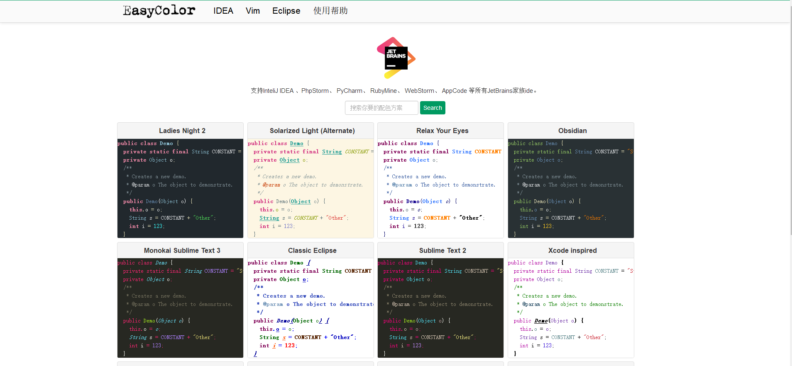

# 设置配色方案

在网上发现一个大佬设计的一个配色方案的网站，可以选择和设置`IDEA`,`eclipse`,`vim`的配色方案 [www.easycolor.cc](www.easycolor.cc)

使用方法:
* 菜单-> File->Import Setting.选择你下载的jar文件；
* 重启IDE之后配置：打开File->Settings->Editor->Colors and fonts 然后选择你安装的主题即可完成 